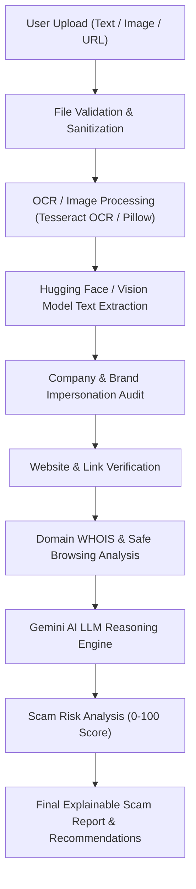
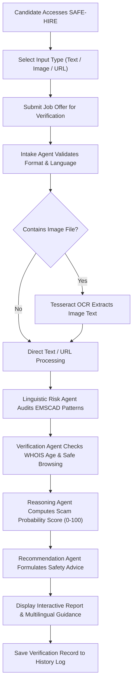

# SAFE-HIRE

**SAFE-HIRE** is a multilingual, multi-agent AI-powered recruitment scam detection platform designed to protect university students, fresh graduates, and job seekers from career fraud. 

Built for the **IDEALIZE 2026** competition (Organized by AIESEC in University of Moratuwa) by **Team T4d** from the South Eastern University of Sri Lanka, SAFE-HIRE provides a unified verification buffer against fraudulent job postings, internship scams, phishing emails, WhatsApp recruitment messages, and fake company websites. Candidates can input job text, upload mobile screenshots or recruitment flyers, or paste URLs to receive an immediate, explainable risk verdict before taking action.

---

## Problem Statement

Recruitment fraud has escalated significantly due to the accessibility of generative AI tools. Fraudster networks craft authentic-looking appointment letters, clone corporate brand identities, create lookalike employer websites, and issue fake job postings targeting students who are under pressure to secure entry-level employment.

Common scam vectors include:
* **Fake Processing & Registration Fees:** Extortion of non-refundable "application fees", "training charges", or "security deposits" in local currencies (LKR, INR, USD, TK).
* **Unverified Messaging Scams:** Direct solicitations via personal WhatsApp numbers or Telegram channels without formal interview processes.
* **Corporate Brand Impersonation:** Fraudulent recruiters claiming to represent global or national corporations while operating from free email addresses (e.g., `company.hr@gmail.com`).
* **Phishing & Lookalike Domains:** Newly registered websites mimicking corporate brands to capture sensitive personal documents and national identity data.

Existing verification tools analyze single channels in isolation (such as checking an email header or scanning a URL) and lack native support for regional South Asian languages, leaving students in the region vulnerable to financial loss and identity theft.

---

## Our Solution

SAFE-HIRE unifies multi-channel verification into a single digital safety platform powered by a **5-Agent AI Pipeline**. 

When a user submits content, SAFE-HIRE performs multi-layer analysis combining Optical Character Recognition (OCR), NLP linguistic risk detection, domain WHOIS verification, Google Safe Browsing threat lookups, and generative LLM reasoning. The system calculates a transparent **Scam Probability Score (0–100)** and generates an **Explainable AI Decision Report** in the user's preferred language (English, Sinhala, Tamil, Hindi, or Bengali), accompanied by actionable safety recommendations.

---

## Core Features

* **Multi-Modal Content Analysis:** Accepts raw text, email messages, job flyer images, mobile screenshots, and website URLs.
* **Tesseract OCR & Vision Extraction:** Extracts embedded text from recruitment posters, WhatsApp chat screenshots, and mobile graphics.
* **5-Agent AI Pipeline:** Specialized autonomous agents handling Intake, Linguistic Risk Analysis, Live Domain Verification, LLM Reasoning, and Recommendation Generation.
* **EMSCAD Scam Pattern Matching:** Rule engine trained on 17,880 job postings detecting urgency pressure tactics, fee demands, and generic contact channels.
* **Live Domain WHOIS & Age Audit:** Queries domain registration records to flag newly created domains (< 90 days old) and suspicious domain extensions.
* **Google Safe Browsing Threat Check:** Cross-references URLs against Google's Safe Browsing API v4 for phishing and malware risks.
* **Corporate Domain Mismatch Scanner:** Identifies brand impersonation by auditing email domains against claimed corporate identities.
* **Multilingual Localization & Script Detection:** Automatic language identification and report generation in **English**, **Sinhala** (සිංහල), **Tamil** (தமிழ்), **Hindi** (हिंदी), and **Bengali** (বাংলা).
* **Explainable Risk Reports & Guidance:** Generates a 0–100 Scam Probability Score with bulleted justifications and personalized student action steps.
* **Resilient Async Database:** Powered by MongoDB with an automatic in-memory fallback store (`FallbackDatabase`) for zero-downtime execution.

---

## Technology Stack

| Component | Technology / Framework | Usage in Project |
| :--- | :--- | :--- |
| **Frontend** | React 18, Vite, Tailwind CSS | Responsive web application interface |
| **Icons & Charts** | Lucide Icons, Recharts | Interactive UI graphics and risk analytics charts |
| **Localization** | react-i18next, Valsea AI | Multilingual interface and report translation |
| **Backend API** | Python 3.10+, FastAPI, Uvicorn | Asynchronous ASGI server engine |
| **Validation & Auth** | Pydantic v2, PyJWT, Passlib (bcrypt) | Data validation, JWT sessions, password hashing |
| **Database** | MongoDB (Motor Driver), In-Memory Store | Async document storage with graceful in-memory fallback |
| **AI / LLM Engine** | Google Gemini API (`gemini-2.5-flash`), DeepSeek V4 | Contextual reasoning & decision report synthesis |
| **NLP & Rule Engine** | spaCy NLP, EMSCAD Dataset (17,880 posts) | Linguistic pattern matching & scam keyword detection |
| **OCR & Image Parsing**| Tesseract OCR (`pytesseract`), Pillow | Text extraction from mobile screenshots and flyer images |
| **Verification APIs** | APILayer WHOIS API, `python-whois`, Google Safe Browsing API v4 | Domain age verification & URL threat scanning |
| **Email Audit** | Abstract Email API, `email-validator` | Recruiter email domain deliverability & provider checks |

---

## AI Agent Workflow

The diagram below illustrates how SAFE-HIRE's 5 specialized AI agents process and verify incoming recruitment submissions:



### Agent Roles & Responsibilities

* **Agent 1: Intake Agent** (`intake_agent.py`) — Ingests text, images, or URLs. Auto-detects language via Unicode script ranges (EN, SI, TA, HI, BN) and scrapes URL content using BeautifulSoup4.
* **Agent 2: OCR & Vision Agent** (`intake_agent.py` / Hugging Face) — Executes Tesseract OCR on images and screenshots to extract embedded text and validate whether content represents a job ad.
* **Agent 3: Verification Agent** (`verification_agent.py`) — Executes live external lookups: WHOIS domain age creation checks, Google Safe Browsing threat scans, and recruiter email domain validation.
* **Agent 4: Reasoning Agent** (`reasoning_agent.py`) — Fuses outputs from Agents 1–3 using Google Gemini 2.5 Flash / DeepSeek V4, calculating the quantitative Scam Probability Score (0–100) and generating plain-language reasoning.
* **Agent 5: Recommendation Agent** (`recommendation_agent.py`) — Formulates targeted safety guidance and next-step advice for the user based on the final risk score.

---

## Project Workflow

The flowchart below demonstrates the complete candidate journey through the SAFE-HIRE platform:



---

## Supported Inputs

SAFE-HIRE supports the following recruitment input channels and file formats:

* **Text Inputs:** Copy-pasted job descriptions, suspicious SMS messages, social media text, email body content.
* **Web Content:** Company careers URLs, Google Forms application links, external job portal URLs.
* **Supported File Extensions:**
  * `.png` — Mobile screenshots, WhatsApp chat captures, social media posts
  * `.jpg` / `.jpeg` — Recruitment flyers, print ads, social media banners
  * `.webp` — Web-optimized job advertisement graphics
  * `.pdf` — Formal offer letters and appointment documents (text extracted via OCR/Intake)
  * `.doc` / `.docx` — Job specification text files and application forms (text extracted via Intake)

---

## Installation

### Prerequisites
* **Python** v3.10+
* **Node.js** v18.0+ & **npm**
* (Optional) **Tesseract OCR Engine** installed on host OS

### 1. Backend Setup (FastAPI)

```bash
# Navigate to backend directory
cd backend

# Create virtual environment
python -m venv venv

# Activate virtual environment
# On Windows (PowerShell):
.\venv\Scripts\Activate.ps1
# On Linux / macOS:
source venv/bin/activate

# Install dependencies
pip install -r requirements.txt

# Start backend server
uvicorn app.main:app --reload --host 0.0.0.0 --port 8000
```
Backend API will run at `http://localhost:8000` (Interactive API docs at `http://localhost:8000/docs`).

### 2. Frontend Setup (React + Vite)

In a separate terminal tab:

```bash
# Navigate to frontend directory
cd frontend

# Install Node modules
npm install

# Start Vite development server
npm run dev
```
Frontend Web UI will run at `http://localhost:5173`.

---

## Environment Variables

Configure a `.env` file in the root or `backend/` directory with the following variables:

| Variable Name | Required | Description |
| :--- | :---: | :--- |
| `MONGO_URI` | Yes | MongoDB connection string (e.g. `mongodb://localhost:27017`) |
| `MONGO_DB_NAME` | Yes | Database name (`safe_hire_db`) |
| `JWT_SECRET` | Yes | Secret key for signing JWT authentication tokens |
| `GEMINI_API_KEY` | Yes | Google Gemini AI API key for LLM reasoning |
| `GOOGLE_SAFE_BROWSING_API_KEY` | Optional | API key for Google Safe Browsing v4 threat lookups |
| `APILAYER_KEY` | Optional | APILayer WHOIS API key for live domain age queries |
| `WHOIS_IS_API_KEY` | Optional | Secondary WHOIS lookup API key |
| `ABSTRACT_EMAIL_API_KEY` | Optional | Abstract API key for recruiter email deliverability checks |
| `HF_TOKEN` / `DEEPSEEK_V4_API_KEY` | Optional | Hugging Face Router API key for DeepSeek V4 fallback |
| `VALSEA_API_KEY` | Optional | Valsea AI API key for report translations |

---

## Project Structure

```
SAFE-HIRE/
├── backend/
│   ├── app/
│   │   ├── agents/                   # 5-Agent AI Pipeline Modules
│   │   │   ├── intake_agent.py       # Agent 1 & 2: Intake, Language & OCR
│   │   │   ├── linguistic_risk_agent.py # Agent 2: EMSCAD NLP & Risk Patterns
│   │   │   ├── verification_agent.py # Agent 3: WHOIS, Safe Browsing & Email Audit
│   │   │   ├── reasoning_agent.py    # Agent 4: Gemini 2.5 & DeepSeek V4 Reasoning
│   │   │   ├── recommendation_agent.py # Agent 5: Safety Recommendations Generation
│   │   │   ├── valsea_agent.py       # Valsea AI Translation Agent
│   │   │   └── pipeline.py           # 5-Agent Pipeline Orchestrator
│   │   ├── routes/                   # FastAPI Endpoint Routers
│   │   │   ├── analyze.py            # Analysis execution endpoint
│   │   │   ├── auth.py               # Registration & Login JWT endpoints
│   │   │   ├── history.py            # Submission history endpoints
│   │   │   ├── user.py               # User profile endpoint
│   │   │   └── chat.py               # AI Safety Chatbot endpoint
│   │   ├── config.py                 # Pydantic settings configuration
│   │   ├── database.py               # MongoDB Motor connection with In-Memory fallback
│   │   └── main.py                   # FastAPI application entry point
│   ├── Dockerfile
│   └── requirements.txt              # Python backend dependencies
│
├── frontend/
│   ├── public/                       # Logos, banners, and static assets
│   ├── src/
│   │   ├── components/               # Reusable React UI components
│   │   ├── i18n/                     # Translations (en, si, ta, hi, bn)
│   │   ├── pages/                    # React page views (Landing, Dashboard, Analyze, History, Login)
│   │   ├── App.jsx                   # React application router
│   │   └── main.jsx
│   ├── package.json
│   └── vite.config.js
│
├── .env.example                      # Environment variables template
├── docker-compose.yml                # Docker container configuration
├── firebase.json                     # Firebase deployment config
├── vercel.json                       # Vercel deployment config
└── README.md                         # Project documentation
```

---

## Team

### Team T4d — IDEALIZE 2026 (Open Category)
*Organized by AIESEC in University of Moratuwa*

| Member Name | Role | Institution | Email Contact |
| :--- | :--- | :--- | :--- |
| **M. M. B. Mushan** | Team Lead / AI Engineer | South Eastern University of Sri Lanka | `mmbmushan@gmail.com` |
| **M. N. M. Afnan** | Full Stack Developer | South Eastern University of Sri Lanka | `mohommadhuafnan756@gmail.com` |
| **Jelaxsi Kularasan** | UI/UX & Frontend Lead | South Eastern University of Sri Lanka | `rajanjela22@gmail.com` |
| **Kamsa Jayasankar** | Backend & QA Engineer | South Eastern University of Sri Lanka | `jeyashankarkamsa@gmail.com` |

---

## License

Distributed under the **MIT License**.
